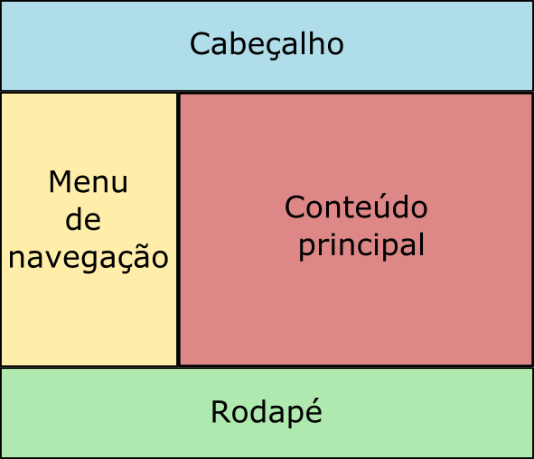

## Descrição:

Neste exercício, você criará um layout de duas colunas à moda antiga, usando a propriedade float no CSS. O objetivo é compreender como o float afeta o fluxo de elementos na página e como criar um layout básico usando essa técnica.

**Todas as alterações devem ser feitas nos arquivos já existentes**

* `src/index.html` -> quando for necessário alterar HTML
* `src/css/estilo.css` -> quando for necessário alterar CSS
* `src/js/script.js` -> quando for necessário alterar JavaScript

## Instruções:

1. Altere arquivo **src/index.html** e dentro do `<body>`, crie um cabeçalho simples com um título da página.
2. Crie uma barra lateral à esquerda ocupando 1/3 do espaço disponível e uma área de conteúdo à direita ocupando espaço restante.
    - Para posicionar a barra lateral e a área de conteúdo, utilize a propriedade float.
3. Aplique estilos CSS para estilizar a aparência do layout.    
    - Você pode definir larguras, alturas, cores de fundo,  margens, preenchimentos e bordas para cada coluna.
4. Certifique-se de que o conteúdo do cabeçalho, da barra lateral e da área de conteúdo esteja visível e formatado adequadamente.
5. Adicione um rodapé na parte inferior do layout, abaixo das colunas, mantendo o fluxo correto dos elementos.
6. Salve seus arquivos e abra o arquivo layout.html em um navegador para verificar o layout que você criou.

Dicas:

* Use a propriedade float com valores como `left` ou `right` para posicionar elementos lado a lado.
* Use as propriedades de CSS, como `width`, `height`, `background-color`, `margin`, `padding` e `borde`r, para estilizar suas colunas e elementos.
* Você pode usar elementos HTML como `<header>`, `<nav>`, `<aside>` e `<section>` para criar a estrutura semântica do layout.

Ao final do exercício o layout deve ficar parecido com isso:

## Recomendações

**Certifique-se de validar seu código HTML usando um validador como o [W3C Markup Validation Service](https://validator.w3.org/), para garantir que seu código esteja sem erros e bem formado**.

**Experimente validar o seu código CSS em sites como:**

- <a href="https://jigsaw.w3.org/css-validator/" target="_blank">W3C CSS validation Service</a>
- <a href="https://beautifytools.com/css-validator.php" hreflang="en" target="_blank">Beatifytools CSS validator</a>
